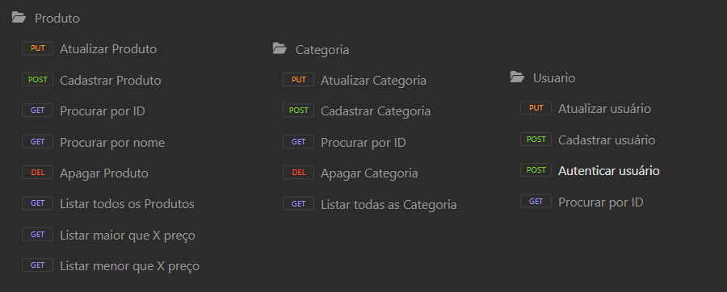

<h1 align="center"> API Loja de Games </h1>

Projeto desenvolvido no Framework Spring durante o Bootcamp Desenvolvedor Java Fullstack da Generation Brasil.

A API Rest conta com Geração e Validação do Token JWT e Spring Security.

<h2> 🛠 Tecnologias: </h2>

As seguintes tecnologias foram usadas na construção do projeto:

### 💬 Assuntos abordados:

- Sistemas web e recursos
- Cliente/servidor, HTTP, JSON
- Padrão Rest para API web
- Estruturação de projeto Spring Rest
- Entidades e Mapeamento Objeto-Relacional (ORM)
- Padrão camadas
- Controller, Service, Repository

## EndPoints:

Abaixo consta os recursos da API:

## Dependências utilizadas no projeto:

| Dependência | Descrição |
| --- | --- |
| Spring Web | Essa dependência fornece todas as bibliotecas necessárias para criar um projeto WEB e trabalhar com o protocolo HTTP/HTTPS. |
| Spring Boot Dev Tools | Permite a atualização do projeto em tempo real durante o processo de Desenvolvimento da aplicação. |
| Starter Security | Responsável por todas as dependências relacionadas à segurança do Spring. Dentro desta dependência, existem outras 3 dependências: spring-security-core, spring-security-config e spring-security-web |
| JWT | As dependências jjwt-api, jjwt-impl e jjwt-jackson são responsáveis por gerar e validar o Token JWT. |

<h2> Autor: </h2>

Feito com ❤️ por Giselle Souza. 👋
 

